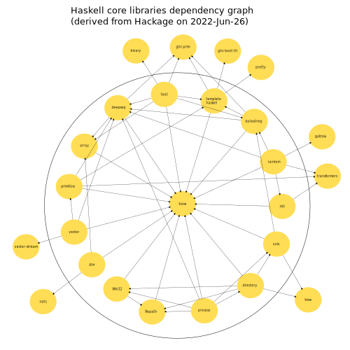
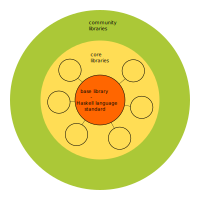

<h1>Haskell core library dependency analysis and language architecture proposal</h1>
<h2>Date: 2022-Jun-27</h2>
The possibility that everyone can contribute to the Haskell ecosystem is a big advantage. On the other side, this can potentially cause some friction in the community. I think there could be a lot of potential released if the many bright minds who write Haskell would become a bit more coordinated through some loose guidelines. I'm not aware of any architectural guidelines for writing Haskell libraries, so thought I would share my ideas. 
Since Haskell is the basis of my work and the language has evolved a lot since Haskell2010, I would like to see an official language specification. In the last 5 years since I've been using Haskell, I feel like that things don't really make progress in this regard, e.g. the failure of the Haskell2020 specification. Also it's sad to see that all Haskell compilers except GHC died years ago. This is mainly due to the extensive use of GHC language extensions and internal parts of GHC in libraries. 

<h2>Dependency Analysis</h2>
While I feel like some things could be better, I see that if you only use libraries that are used be many people and have less dependencies on their own, things are quite unproblematic. Thankfully Hackage has the feature to see how often a package is downloaded. Also there is the useful reverse dependency <a href="https://packdeps.haskellers.com/reverse">site</a>. To figure out how things could be improved I first looked on the dependencies of the core libraries. The base library and core libraries are enclosed in the big circle:
  

<h3>Some things that stand out:</h3>
<ul>
<li>There are non core libraries that are used by core libraries.</li>
<li>Some core libraries directly use internals of GHC.</li>
<li>The deepseq library is most commonly used by other core libraries, so there are probably features included that would be better off including in base.</li>
</ul>

<h2>Architecture proposal</h2>
One of Haskell's concepts are pure functions. So why not have something like a pure architecture and decouple core libraries from each other such that each library only depends on the base library?

<h3>What would be the attributes of the core libraries?</h3>
<ul>
<li> A core library is one that only depends on base and is declared as such from the maintainers</li>
<li> Once a library is declared as "core" it's status should not changed again to "non core"</li>
<li> Dependencies among different core libraries should be not allowed.</li>
<li> GHC language extensions shouldn't be used by core libraries.</li>
<li> Core library authors and maintainers should actively request their needed features from the base library maintainers.</li>
<li> Datastructures like different array types or text could be a core library.</li>
</ul>

<h3>What would be the attributes of base?</h3>
<ul>
<li> Base would be the library where the formal language specifications are implemented.</li>
<li> It consists of the common sense basis of Haskell.</li>
<li> The most useful language extensions could be integrated in base.</li>
<li> There shouldn't be fundamental breaking changes from the existing standard. Especially basic datastructures like <b>String</b> and <b>List</b> shouldn't be removed.</li>
<li> Primitive data types are included in base.</li>
<li> Base should provide low level structures for writing high performance code.</li>
<li> Functions in base must not be safe at all cost.</li>
<li> Base should be kept small but large enough for core library authors.</li>
<li> Base should be independent of GHC.</li>
</ul>

<h3>What would be the benefits of such an architecture?</h3>

<ul>
<li>Since each core library has no other dependency than base, the common useful things would be pushed into base. When this architecture would be reached, a new language specification could be derived from base. It would be easier to define from a small base than from the whole set of core libraries.</li>
<li>Core libraries would be easier to maintain as they would only depend on base.</li>
<li>It would be easier to improve the Haskell ecosystem in the future, as changes in core libraries could be done easier than changes of the language standard.</li>
<li>There could be alternative core libraries that do similar things. In the end the best library would prevail.</li>
<li>There could be core libraries that focus more on performance and others that focus more on safety.</li>
<li>The language standard would naturally evolve as core library authors and maintainers would request things from base they need.</li>
<li>With a consensous about the architecture there could be less room for long non constructive debates.</li>
<li>Haskell compiler authors would benefit since they would only have to implement the small language standard.</li>
<li>It would be better for production environments as one knows what to expect from a core library or a community library.</li>
<li>Decisions could be made easier if everyone knows their area of responsibility and the common goal.</li>
</ul>

<h3>Is this a realistic goal?</h3>
The dependency graph does not actually look that bad, and we might be going already in that direction.

